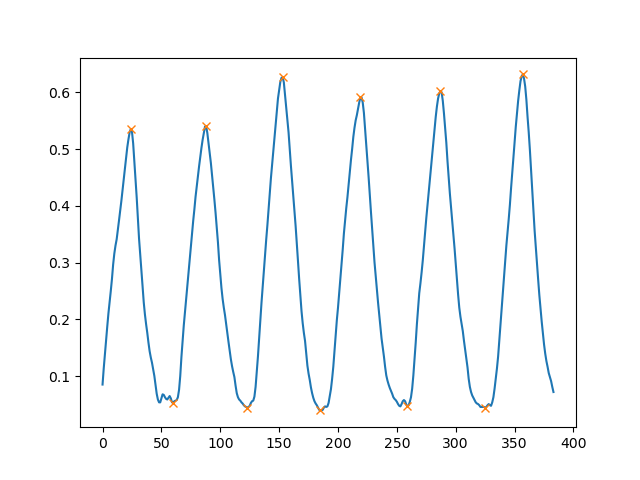
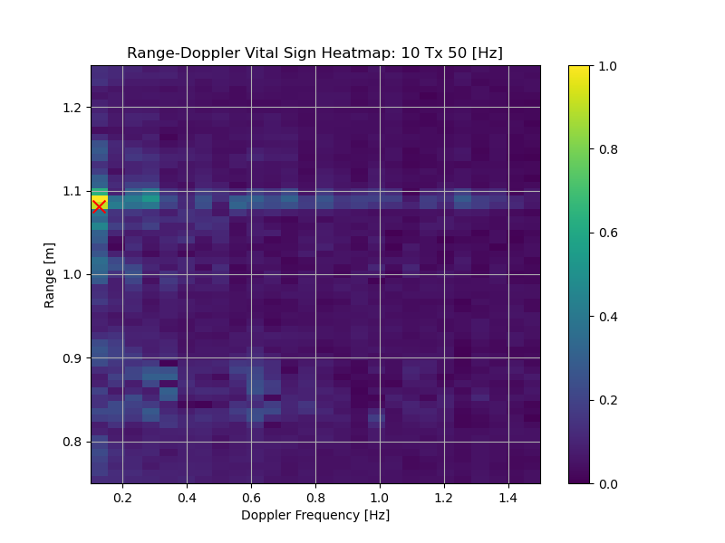

# Baseline Comparision

We compare our work (BSENSE) with a baseline bpm detection that identifies the peak of in range doppler as the BPM.

## Run BSENSE

1. From the base BSENSE directory, move to the baseline directory
```bash
cd baseline
```
2. Run BSENSE with `python3 bsense/main.py`. 

This runs BSENSE with one radar recording and outputs:
* **Ground truth BPM**
* **Estimated BPM** by using BSENSE

## Run Baseline Range-Doppler

Run the range-doppler BPM detection by running from the baseline directory:

```bash 
# cd baseline
python3 doppler/main.py
```

It will calculate:

* **Ground truth BPM**
* **Estimated BPM** by finding the peak in range-doppler

It will produce two plots under current working directory:

* `bsense_baseline_doppler_result.png`: visualize the peak in range doppler
* `bsense_baseline_gt_peaks.png`: visualize peaks in the ground truth respiration wave

## Sample result

We randomly choose one radar data recording to demonstrate our model's effectiveness. 

The ground truth respiration wave is (x axis is number of samples, y is the force that the ground truth device measured):



**The ground truth BPM is: 17.183**

### Using Range Doppler

Range doppler profile is:



The highlighted red cross is the peak frequency, corresponding to **3.78 BPM**. 

### Using BSENSE

The result is:

```bash
'bpm_gt': 17.183412551879883,
'bpm_radar': 14.044675827026367
```
